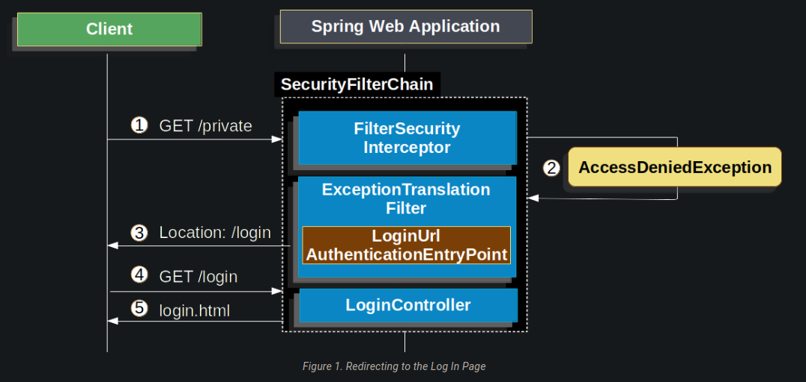
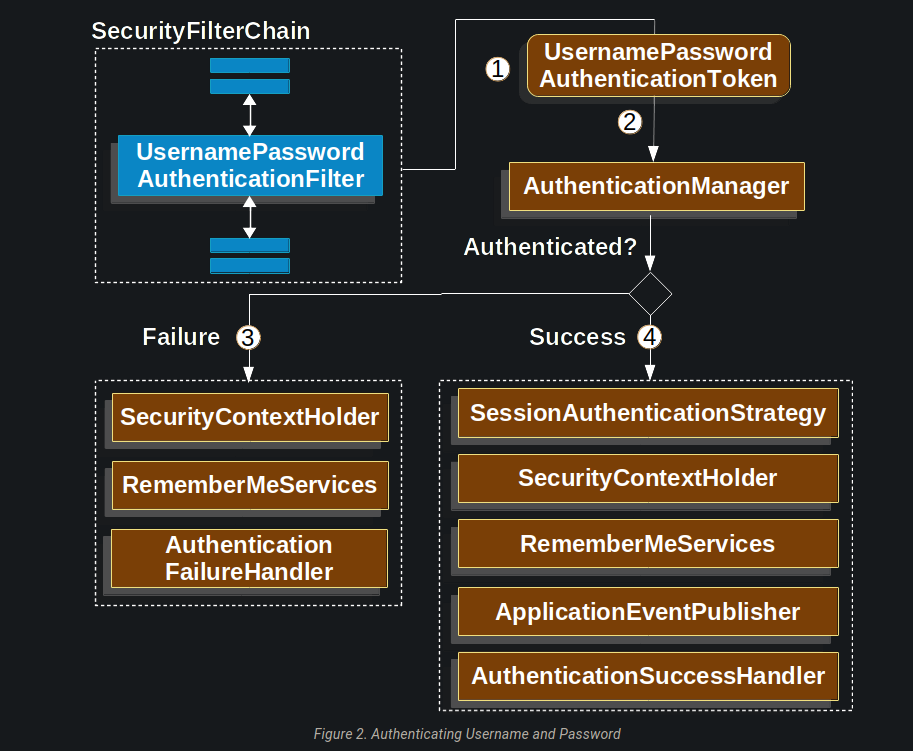
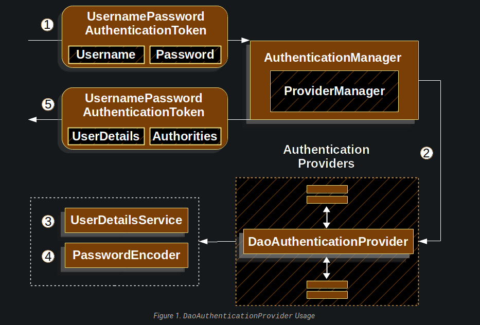

### Spring Security
    SecurityContextHolder - 存放验证信息

    SecurityContext - 获取当前登录用户的验证信息

    Authentication - 可以是AuthenticationManager的输入，以提供用户提供的认证凭证，或来自SecurityContext的当前用户。

    GrantedAuthority - 认证用户被授予的权限

    AuthenticationManager - 定义了Spring Security的过滤器如何执行验证

    ProviderManager - 是AuthenticationManager最常见的实现。

    AuthenticationProvider - 由ProviderManager用于执行特定类型的认证。

    Request Credentials with AuthenticationEntryPoint - 用于向客户端请求证书（即重定向到一个登录页面，发送一个WWW-Authenticate响应，等等）

    AbstractAuthenticationProcessingFilter - 一个用于认证的基础过滤器。这也让我们很好地了解了认证的高层流程，以及各部分如何协同工作。


#### 1、表单登录

表单请求：流程



1.当一个未验证的请求过来,FilterSecurityInterceptor将会拦截，抛出一个AccessDeniedException.

2.ExceptionTranslationFilter将会拦截这个异常，将这个请求重定向到AuthenticationEntryPoint

3.重定向到登录页面

验证用户流程：



1.表单提交过来的用户和密码会被UsernamePasswordAuthenticationFilter拦截器拦截，然后尝试去执行attemptAuthentication()去验证用户

2.获取AuthenticationManager，然后去执行用户验证方法authenticate(),判断是否验证成功

3.验证用户成功的话：
则SessionAuthenticationStrategy被通知有新的登录信息，认证信息被保存到SecurityContextHolder、RememberMeServices.loginSuccess将会被调用、
ApplicationEventPublisher发布一个InteractiveAuthenticationSuccessEvent、AuthenticationSuccessHandler会被调用

4.验证用户成功的话：
SecurityContextHolder的当前用户信息将会被清除、RememberMeServices.loginFail会被调用、AuthenticationFailureHandler会被调用


#### 2、DaoAuthenticationProvider（基于JDBC方式验证）

DaoAuthenticationProvider是一个AuthenticationProvider的实现，它利用UserDetailsService和PasswordEncoder来验证一个用户名和密码。



1.读取用户名和密码的认证过滤器将一个UsernamePasswordAuthenticationToken传递给由ProviderManager实现的AuthenticationManager。

2.ProviderManager被配置为使用一个DaoAuthenticationProvider类型的AuthenticationProvider。

3.DaoAuthenticationProvider将从UserDetailsService中查找UserDetails。

4.然后，DaoAuthenticationProvider使用PasswordEncoder来验证上一步返回的UserDetails上的密码。

5.当认证成功时，返回的认证是UsernamePasswordAuthenticationToken类型的，并且有一个委托人是由配置的UserDetailsService返回的UserDetails。
最终，返回的UsernamePasswordAuthenticationToken将被认证Filter设置在SecurityContextHolder上。


#### 3、Authorization（授权）

开启全局方法注解
```java
@EnableGlobalMethodSecurity(prePostEnabled = true) // 需要将prePostEnable的值设置为true
@Configuration
public class SecurityConfig {
    
}
```

开启全局方法注解之后就可以在方法中使用@PreAuthorize注解,注解里面的EL表达式需要返回类型为Boolean
```java
@RestController
public class WebController {


    @PreAuthorize("@ss.isAdmin('ADMIN')")
    @GetMapping("/test")
    public String test() {
        return "test success";
    }
}
```